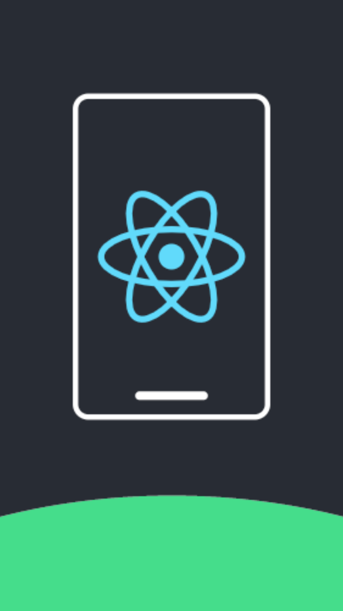

<div style="display:flex;flex-direction:column;align-items:center;justify-content:center;font-weight:bold;font-size:1rem" >
<h1>React Native Chat App</h1>


Download The Android Apk By Clicking [Here](https://drive.google.com/file/d/1OYia-6pMIxtyf9wdyKSs2wjRrPLcMuUM/view?usp=sharing)<br>
How To SetUp This Project
```bash
1. git clone https://github.com/PhantomKnight287/ReactNative.git
2. cd ReactNative
3. Rename .env.example to .env and fill appropriate details
4. npm install
5. npm start
```
</div>
